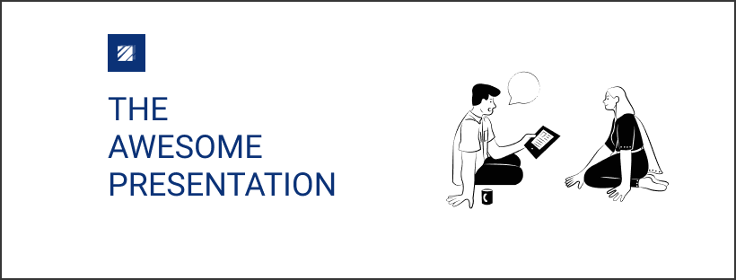

# Apresentação incrível

> Um modelo para fazer palestras e apresentações técnicas.

## visão global

Apresentações impressionantes é um modelo para palestras sobre tecnologia de construção. Idealize para criar pequenas documentações e um exemplo orientado para uma apresentação prática.
A ideia principal é se adequar à sua apresentação principal e manter um registro da documentação para sua apresentação futura.

-   Onde está o código?
    > No exemplo de pasta, você pode compartilhar com seus alunos e colegas qualquer código. Para desafios, exemplos guiados e ótima documentação.

-   Para quem é este repositório?
    > Para quem quer economizar tempo para criar uma estrutura simples para organizar sua apresentação e compartilhar depois, e melhorar o open-source.

-   Qual é o próximo?
    > Queremos melhorar sempre, e uma boa ideia para este repositório, seria construir um controle deslizante personalizado com paginação como modelo para criar uma ótima apresentação.

## Documentação

A documentação do Awesome Presentation ainda está em andamento.

## Contribuindo

Queremos sempre melhorar uma ideia, quer compartilhar sua opinião?[venha aqui](https://github.com/CofferHub/awesome-presentation/issues).
